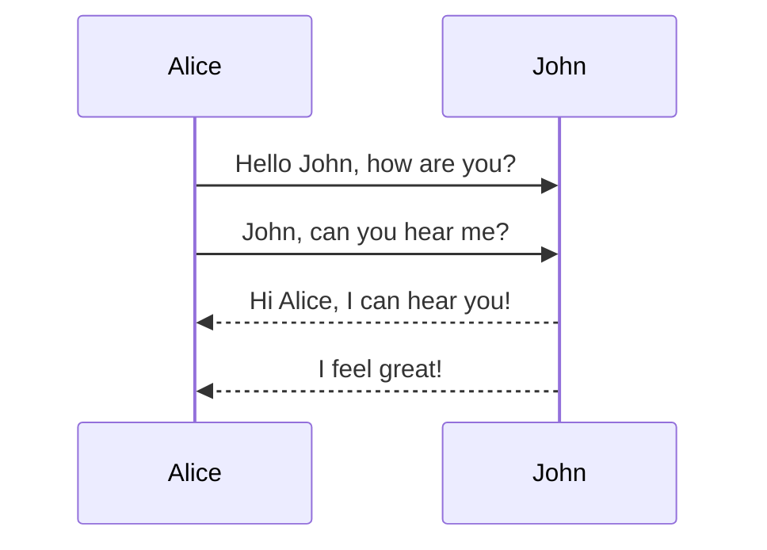

# Demo.Bank.Accounts

## TODO:

- [ ] Docker support with docker compose. 
- [ ] Using SQL server as the database.
- [ ] Database migration as a sidecar.
- [ ] Using storage queues for events.
- [ ] Background service which listens to the queue, and perform operations.

## Features

### Create bank account

### Transfer money between accounts
