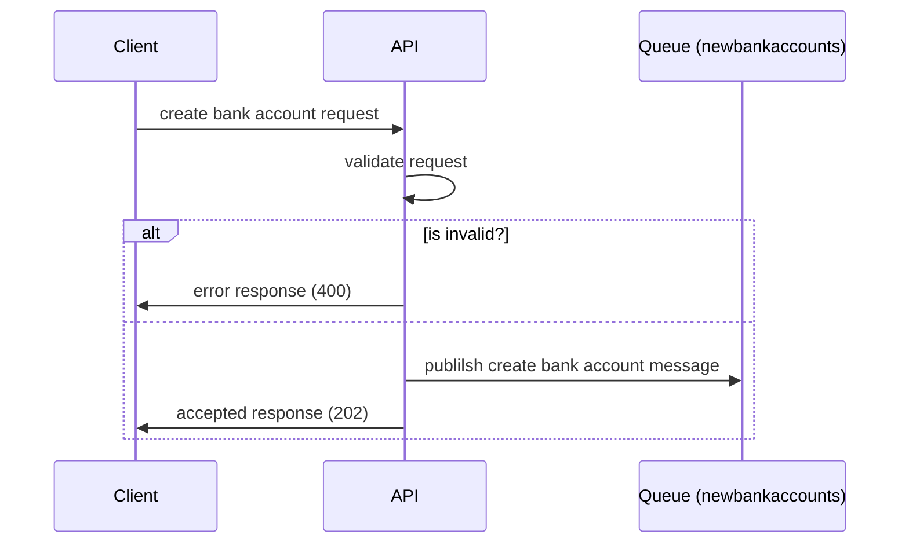

# Demo.Bank.Accounts

## Goals:

- [x] [Document local setup](#local-setup)
- [x] Docker support with docker compose. 
- [ ] Using SQL server as the database.
- [ ] Database migration as a sidecar.
  - [x] Local setup.
  - [ ] Deployed environment.
- [ ] Using storage queues for events.
- [ ] Background service which listens to the queue, and perform operations.

## Local Setup

1. Make sure you have `Docker` installed in your local machine.
2. Open a command prompt and browse to the directory, where you can see the `docker-compose.yml` file.
3. Create a folder called "demodata". This is the mount volume for the SQL server storage.
4. Create a folder called "storagedata". This is the mount volume for Azurite.
5. Run `docker-compose up` command.
6. Browse to `http://localhost:8080/swagger`

[<<Goals](#goals)

## Features

### Create bank account

### Transfer money between accounts

### References

- [Creating mermaid diagrams in GitHub readme](https://docs.github.com/en/get-started/writing-on-github/working-with-advanced-formatting/creating-diagrams)
- [Using the Azurite emulator for local Azure Storage development](https://docs.microsoft.com/en-us/azure/storage/common/storage-use-azurite?tabs=visual-studio)